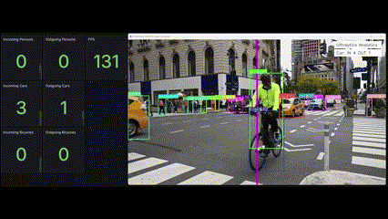
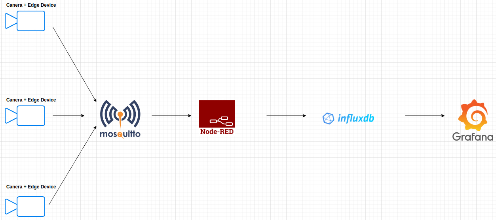

## YOLO v8 Multi-Class Counter

There are two examples of using YOLO v8 for counting entry and exits for a particular class, i.e., counting all the instances of a particular type of object or class in an image or video clip as they move in and out of a particular area. An application of this could be for traffic counts, you could count the people walking on the sidewalk, cars, bicycles, trucks, etc., and use that for better city planning.
There are two examples:

* A general example that generates a JSON payload with the counts of those items entering and exiting the area
* A data pipeline example that generates MQTT messages that are picked up by an MQTT broker and the written to InfluxDB for viewing via Grafana. MQTT was chosen because it’s a fairly low power protocol and it allows for two way communication, thus making it quite useful for a solution that could potentially be deployed on a low powered edge device.

### Multi-Class Counter with Data Pipeline – Additional Details

**Note #1:** the dashboard updates every 5 seconds vs the on screen data updating with every frame, so the dashboard will lag the on screen data. 

**Note #2:** similar to the above, there would probably not be a need to update to render the video in real time, we would just capture the data and transmit it to where it needs to go. This also means that hardware that processes the videos *slower than real time* could be okay in certain instances where we don't need real time data.

The data architecture is fairly simple: Node-RED functions as a sort of conductor, it picks up the messages from Eclipse-Mosquitto and then writes the data to InfluxDB. From there Grafana is used to display the data. 

For this example I just used the data collection infrastructure I built for my [Data Platform Project](https://github.com/MarkhamLee/finance-productivity-iot-informational-weather-dashboard) which runs on the [Kubernetes (K3s distro) cluster](https://github.com/MarkhamLee/kubernetes-k3s-data-and-IoT-platform), I built to support the Data Platform and some other projects. A similar "edge cluster" could be appropriate in scenarios where there needs to be quick on-site reactions to things detected in the videos, but that solution should still have a cloud back-up. Outside of a need for fast on-site responses, it would probably make more sense to send all the video data to the cloud and analyze it there.